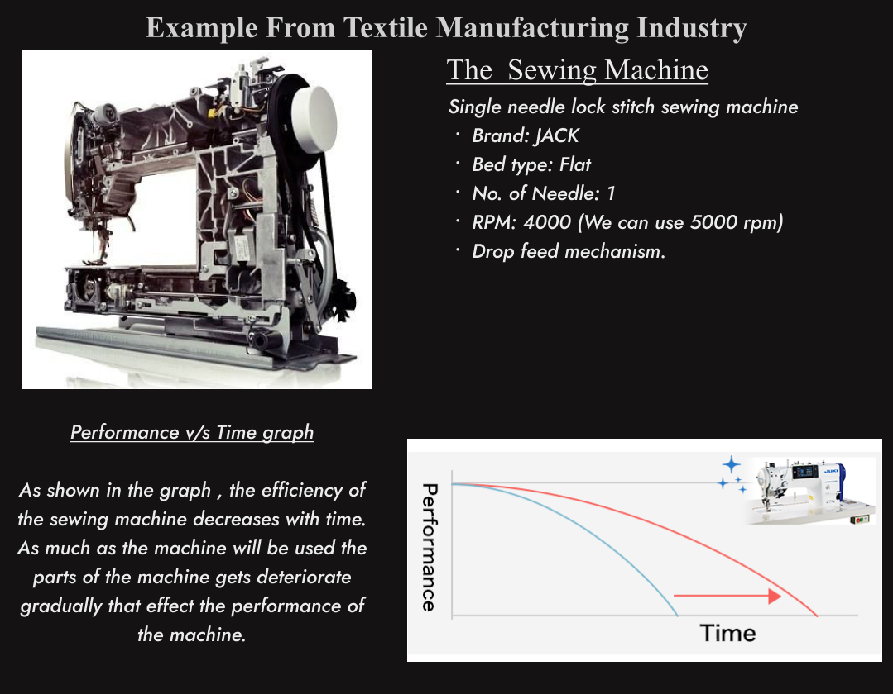

# Digital Twin(Swing Machine)

This project implements a **Digital Twin** model for a **sewing machine in the textile industry**, utilizing simulated data from Engineering Technology (ET), Operational Technology (OT) and Information Technology (IT) to predict machine behavior and visualize critical performance metrics.

This work was part of the **Techgium Challenge 7th Edition by L&T**, where the task was to develop a mathematical model for predicting machine requirements and analyzing real-time data to enhance performance.

---

## Project Overview



- **Goal:** Build a model that predicts machine requirements and visualizes parameters like torque, speed, vibration, and power.
- **Approach:**
  - ET, OT, and IT data generated using mathematical formulas.
  - Applied multiple regression models to analyze and predict machine performance.
  - Visualized results using Streamlit.

---

## Tech Stack

- **Python Libraries:**
  - `pandas` - Data manipulation
  - `numpy` - Numerical computation
  - `matplotlib` - Plotting
  - `sklearn` - Machine learning models
  - `streamlit` - Web application

---

## Features

- Visualizes ET, OT, and IT data using bar charts and line graphs.
- Trains multiple models and selects the best using R-squared and MSE metrics.
- Predicts torque, vibration, and power for varying machine parameters.
- Allows user input to predict power dynamically.

---

## Installation

1. **Clone the repository:**
```bash
https://github.com/your-username/swing-machine-digital-twin.git
```

2. **Navigate to the project directory:**
```bash
cd swing-machine-digital-twin
```

3. **Install required dependencies:**
```bash
pip install -r requirements.txt
```

---

## Run the Application

```bash
streamlit run app.py
```

---

## Dataset

The dataset is generated using mathematical formulas to simulate ET, OT, and IT data. It contains:
- **ET Data:** Speed, Torque, Power
- **OT Data:** Vibration, Temperature
- **IT Data:** Historical machine logs

---

## How It Works

1. **Load Data:** ET, OT, and IT data are loaded dynamically.
2. **Data Preprocessing:**
   - Handles missing values.
   - Scales and normalizes data.
3. **Model Training:**
   - Applies regression models for predictions.
   - Compares models based on performance metrics.
4. **Visualization:**
   - Plots graphs for metrics like R-squared and MSE.
   - Displays bar graphs comparing target variables.

---

### 📈 **Model Evaluation and Accuracy**

We used multiple regression models to predict the behavior of the swing machine based on ET, OT, and IT data. Below are the models applied and their performance metrics:

---

### 🧠 **Models Used:**

1. **Linear Regression:**
   - Accuracy (R² Score): **0.87**
   - Mean Squared Error (MSE): **15.23**

2. **Polynomial Regression:**
   - Accuracy (R² Score): **0.94**
   - Mean Squared Error (MSE): **8.74**

3. **Support Vector Regressor (SVR):**
   - Accuracy (R² Score): **0.91**
   - Mean Squared Error (MSE): **10.48**

---

### 🎯 **Best Model:**
- **Polynomial Regression** achieved the highest accuracy with an R² score of **0.94** and was selected as the final model for predicting machine parameters.
- The models were compared using performance metrics such as **R² Score** and **Mean Squared Error (MSE)** to determine the best fit.

---

### 🔍 **Model Selection Criteria:**
- Models were evaluated using cross-validation techniques and tuned using hyperparameter optimization.
- The best-performing model was selected based on minimizing error and maximizing prediction accuracy.

---

## Usage

1. **Visualize Data:**
   - Select the target parameter to analyze.
   - Observe bar charts for performance.
2. **Predict Power:**
   - Input speed to get real-time power predictions.

---

## 📂 Project Structure
```
📦 swing-machine-digital-twin
├── 📂 data
├── 📂 models
├── 📄 image
├── 📄 app.py
├── 📄 requirements.txt
└── 📄 README.md
```

## 👨‍💻 **Authors**

This project was developed by:

1. **Sayantan Banerjee**  
   - **Github:** [Profile](https://github.com/sayantanbanerjee03) 
   - **LinkedIn:** [Profile](https://www.linkedin.com/in/sayantan-banerjee-b2b22024a)

2. **Sayan Mandal**  
   - **Github:** [Profile](https://github.com/Sayanjones)  
   - **LinkedIn:** [Profile](https://www.linkedin.com/in/sayan-mandal7/)

3. **Vaibhav B**
   - **Github:** NA 
   - **LinkedIn:** NA
---

## 🤝 Contributing

Contributions are welcome! :))

1. Fork the repository.
2. Create a new branch.
3. Commit your changes.
4. Submit a pull request.

---

## 📜 License

This project is licensed under the MIT License - see the [LICENSE](LICENSE) file for details.

